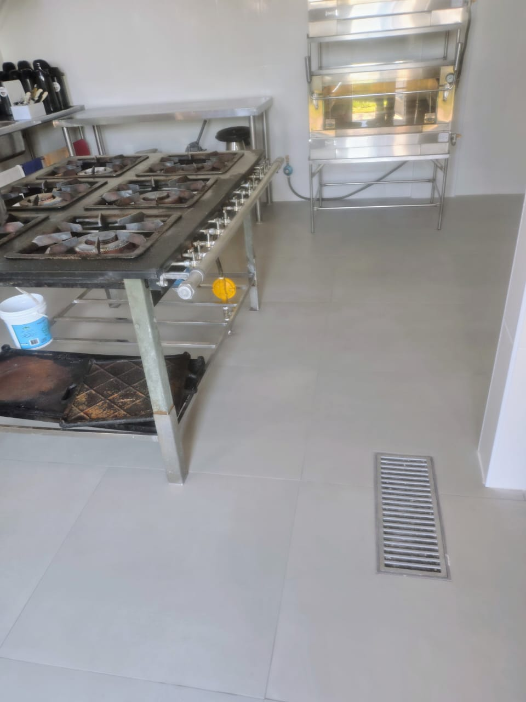

# Construtora Marvit Excellence — Site Institucional

> Site institucional single-page de alto padrão para a Construtora Marvit Excellence, especializada em obras industriais e corporativas em Valinhos/SP.


---

## Sumário

- [Visão Geral](#visão-geral)
- [Estrutura de Arquivos](#estrutura-de-arquivos)
- [Como Usar](#como-usar)
- [Tecnologias](#tecnologias)
- [Estrutura do Código](#estrutura-do-código)
- [Personalização](#personalização)
- [Hospedagem](#hospedagem)
- [Manutenção](#manutenção)
- [Boas Práticas Aplicadas](#boas-práticas-aplicadas)
- [Contato](#contato)

---

## Visão Geral

Single-page institucional com 8 seções principais, design editorial-arquitetônico, totalmente responsivo (mobile-first) e formulário de orçamento integrado ao WhatsApp.

**Cliente:** Construtora Marvit Excellence
**Endereço:** Avenida Rosa Belmiro Ramos, 811 — Valinhos/SP — CEP 13275-400
**CNPJ:** 64.820.084/0001-92
**Telefone:** (19) 99965-9191

### Seções do site

1. **Hero** — destaque com chamada principal e estatísticas
2. **Sobre** — 3 pilares (Pontualidade, Materiais Premium, Engenharia)
3. **Serviços** — 4 cards (Construção, Reformas, Gerenciamento, Design)
4. **Portfólio** — 8 obras reais de 4 clientes corporativos
5. **Depoimentos** — carrossel com auto-play
6. **Clientes** — marquee de 9 empresas atendidas
7. **Contato** — formulário com integração WhatsApp
8. **Footer** — navegação, contatos e dados institucionais

---

## Estrutura de Arquivos

```text
marvit-site/
├── index.html              # Arquivo principal (HTML + CSS + JS embutidos)
├── README.md               # Esta documentação
└── img/                    # Imagens das obras
    ├── parason-01.jpg      # Tanque criogênico — Parason Indiana
    ├── parason-02.jpg      # Içamento com guindaste — Parason Indiana
    ├── optima-01.jpg       # Sala operacional — Óptima do Brasil
    ├── optima-02.jpg       # Galpão e mezanino — Óptima do Brasil
    ├── kadant-01.jpg       # Cozinha industrial — Kadant
    ├── kadant-02.jpg       # Fachada corporativa — Kadant
    ├── fluidra-01.jpg      # Fluidra Pro Center — Fluidra do Brasil
    └── fluidra-02.jpg      # Fachada principal — Fluidra do Brasil
```

---

## Como Usar

### Visualização local (mais simples)

1. Descompacte o ZIP do projeto
2. Dê duplo clique em `index.html`
3. O site abre no navegador padrão

> **Nota:** não é necessário instalar nada nem rodar servidor. Funciona em qualquer navegador moderno (Chrome, Firefox, Safari, Edge).

### Visualização com servidor local (recomendado para desenvolvimento)

Caso queira rodar um servidor local para evitar restrições de CORS:

```bash
# Com Python 3 (já vem instalado em Mac/Linux)
cd marvit-site
python3 -m http.server 8000

# Acesse no navegador: http://localhost:8000
```

```bash
# Ou com Node.js
npx serve marvit-site
```

---

## Tecnologias

| Tecnologia | Função | Versão |
|---|---|---|
| **HTML5** | Estrutura semântica | — |
| **Tailwind CSS** | Framework utility-first (via CDN) | 3.x |
| **JavaScript (vanilla)** | Interatividade sem frameworks | ES6+ |
| **Google Fonts** | Cormorant Garamond + Manrope | — |
| **Intersection Observer API** | Animações de scroll | nativo |
| **WhatsApp wa.me API** | Envio do formulário | — |

**Sem dependências de build.** Não usa Node, npm, webpack, vite ou qualquer ferramenta de bundling. O HTML carrega tudo via CDN.

---

## Estrutura do Código

O arquivo `index.html` está organizado com **índices `[XX]` em todos os comentários** para facilitar navegação. Use a busca do editor (Ctrl/Cmd + F) para encontrar uma seção:

### Mapa de seções HTML

| Índice | Seção | Linha aprox. |
|---|---|---|
| `[HEAD]` | Meta tags, fontes, Tailwind | 30–55 |
| `[CSS]` | Estilos customizados | 55–470 |
| `[01]` | Header / Navbar | 480 |
| `[02]` | Hero | 560 |
| `[03]` | Sobre — 3 pilares | 660 |
| `[04]` | Serviços | 760 |
| `[05]` | Portfólio | 860 |
| `[06]` | Depoimentos + Clientes | 980 |
| `[07]` | CTA / Contato | 1110 |
| `[08]` | Footer | 1230 |
| `[09]` | Botão flutuante WhatsApp | 1540 |

### Mapa de funções JavaScript

| Índice | Função | O que faz |
|---|---|---|
| `[JS-01]` | Navbar dinâmico | Muda fundo do header ao rolar |
| `[JS-02]` | Menu mobile | Abre/fecha menu hambúrguer |
| `[JS-03]` | Reveal on scroll | Anima elementos ao entrarem na viewport |
| `[JS-04]` | Carrossel | Controla depoimentos (anterior/próximo/auto-play) |
| `[JS-05]` | Smooth scroll | Rolagem suave nos links âncora |
| `[JS-06]` | Formulário WhatsApp | Envia orçamento via wa.me |
| `[JS-07]` | Botão flutuante | Mostra/esconde botão de WhatsApp |

---

## Personalização

### Alterar o número de WhatsApp

Em `index.html`, busque por `WHATSAPP_NUMBER` (linha ~1455):

```javascript
const WHATSAPP_NUMBER = '5591982516477'; // ← edite aqui
```

> **Formato:** código do país + DDD + número, **sem `+`, espaços ou traços**.
> Exemplo: `+55 (91) 98251-6477` → `5591982516477`

Lembre-se de atualizar também o `href` do **botão flutuante** (linha ~1545):

```html
<a id="whatsapp-float" href="https://wa.me/5591982516477?text=...">
```

### Alterar a paleta de cores

No bloco `:root` (início do `<style>`), edite as variáveis CSS:

```css
:root {
    --ink: #0a1428;       /* Cor principal escura */
    --paper: #f5f3ee;     /* Fundo claro */
    --gold: #b08d3f;      /* Acento dourado */
    --muted: #4a4538;     /* Texto secundário */
    /* ... */
}
```

Todas as cores do site são derivadas dessas variáveis. Trocando aqui, o site inteiro muda.

### Trocar imagens do portfólio

1. Salve a nova imagem na pasta `img/` (ex: `cliente-novo.jpg`)
2. Em `index.html`, busque pelo arquivo antigo (ex: `kadant-01.jpg`)
3. Troque o caminho e ajuste a legenda

```html
<!-- Antes -->


<!-- Depois -->

```

> **Dica de performance:** redimensione as fotos para no máximo 1600px de largura e exporte em JPEG com qualidade 80–85. Isso reduz o peso sem perder qualidade visível.

### Adicionar/remover depoimentos

Cada depoimento é um `<div class="testimonial-slide">` dentro de `#testimonial-track`. Após adicionar/remover, atualize a constante `totalSlides` em `[JS-04]`:

```javascript
const totalSlides = 3; // ← ajuste se mudar a quantidade
```

E os botões/dots correspondentes no HTML (busque por `class="dot"`).

### Alterar a lista de clientes (marquee)

Busque pelo comentário `<!-- Clientes -->` na seção `[06]`. Os nomes ficam duplicados (para o loop infinito da animação) — **lembre-se de editar nas duas listas**.

---

## Hospedagem

### Opções gratuitas (recomendadas)

| Serviço | Plano grátis | Domínio personalizado | Recomendado para |
|---|---|---|---|
| **Vercel** | Sim | Sim (após pagamento do domínio) | Iniciantes |
| **Netlify** | Sim | Sim | Iniciantes |
| **Cloudflare Pages** | Sim | Sim | Sites com tráfego alto |
| **GitHub Pages** | Sim | Sim | Quem já usa GitHub |

### Passo a passo (Vercel — mais simples)

1. Acesse [vercel.com](https://vercel.com) e crie conta gratuita
2. Clique em **Add New → Project**
3. Arraste a pasta `marvit-site/` inteira
4. Aguarde alguns segundos — o site fica no ar em uma URL `*.vercel.app`
5. (Opcional) Configure um domínio próprio (ex: `marvitexcellence.com.br`)

### Hospedagem em servidor próprio

Como o site é 100% estático, basta enviar os arquivos via FTP/SFTP para qualquer servidor com Apache, Nginx ou similar. Não há necessidade de PHP, Node.js, banco de dados ou qualquer back-end.

---

## Manutenção

### Checklist mensal recomendado

- [ ] Verificar se o número do WhatsApp ainda funciona (enviar teste)
- [ ] Confirmar se as imagens carregam corretamente
- [ ] Testar o formulário em desktop e mobile
- [ ] Verificar links externos (CDN do Tailwind, Google Fonts)
- [ ] Atualizar fotos do portfólio se houver obras novas

### Antes de publicar atualizações

1. Faça backup da versão atual (renomeie `index.html` para `index-backup.html`)
2. Teste localmente abrindo no navegador
3. Teste em pelo menos 2 navegadores diferentes
4. Teste no celular (use o modo responsivo do DevTools ou um dispositivo real)
5. Verifique se os links âncora (`#sobre`, `#servicos` etc.) rolam corretamente

---

## Boas Práticas Aplicadas

Este projeto segue padrões reconhecidos de desenvolvimento web:

- **HTML semântico** — uso de `<header>`, `<nav>`, `<section>`, `<footer>` em vez de `<div>` genéricos
- **Acessibilidade** — atributos `alt` em todas as imagens, `aria-label` em botões com apenas ícones, contraste de texto adequado
- **Mobile-first** — layout pensado primeiro para celular, depois adaptado para desktop
- **Performance** — sem dependências de build, CSS embutido, imagens otimizáveis
- **Variáveis CSS centralizadas** — facilita manutenção de tema
- **Comentários indexados** — todas as seções têm marcadores `[XX]` para navegação rápida
- **Progressive enhancement** — o botão flutuante de WhatsApp funciona mesmo se o JavaScript for desativado
- **SEO básico** — meta tags `title` e `description` configuradas

---

## Pendências e Próximos Passos

Itens que dependem de informações externas para finalização:

- [ ] **Autorização formal dos clientes** (Kadant, Parason, Óptima, Fluidra) para uso público dos nomes e fotos
- [ ] **Logos oficiais** das empresas-cliente para substituir o texto no marquee
- [ ] **Depoimentos reais** com nomes completos das pessoas que os deram
- [ ] **Domínio próprio** (sugestão: `marvitexcellence.com.br`)
- [ ] **E-mail corporativo** ativo no endereço usado no rodapé
- [ ] **Páginas internas** opcionais (Sobre Nós completa, Portfólio expandido)
- [ ] **Google Analytics** ou similar para mensurar tráfego
- [ ] **Política de Privacidade e Termos de Uso** (links já estão no footer aguardando conteúdo)

---

## Contato

Para suporte técnico ou novas alterações neste site, entre em contato com o desenvolvedor responsável.

**Empresa:** Construtora Marvit Excellence
**Slogan:** *Construindo hoje, realizando o amanhã.*

---

*Documentação atualizada em maio de 2026.*
# Construtora_Marvit

