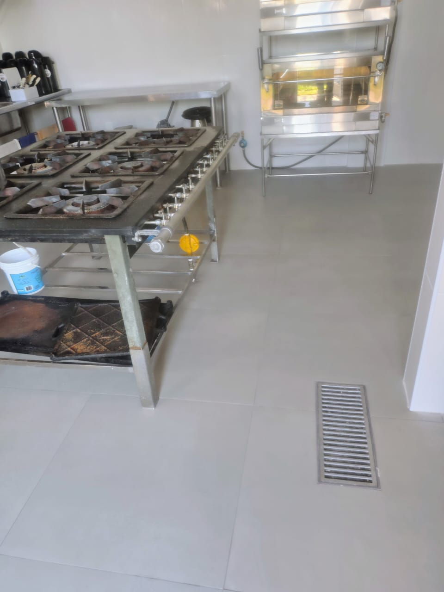

# Construtora Marvit Excellence — Site Institucional

> Site institucional single-page de alto padrão para a **Construtora Marvit Excellence**, especializada em obras industriais e corporativas em Valinhos/SP.


---

## Sumário

- [Visão Geral](#visão-geral)
- [Estrutura de Arquivos](#estrutura-de-arquivos)
- [Como Usar](#como-usar)
- [Tecnologias](#tecnologias)
- [Estrutura do Código](#estrutura-do-código)
- [Personalização](#personalização)
- [Hospedagem](#hospedagem)
- [Manutenção](#manutenção)
- [Boas Práticas Aplicadas](#boas-práticas-aplicadas)
- [Pendências e Próximos Passos](#pendências-e-próximos-passos)
- [Contato](#contato)

---

## Visão Geral

Single-page institucional com **8 seções principais**, design editorial-arquitetônico, totalmente responsivo (mobile-first) e formulário de orçamento integrado ao WhatsApp.

| | |
|---|---|
| **Cliente** | Construtora Marvit Excellence |
| **Endereço** | Avenida Rosa Belmiro Ramos, 811 — Valinhos/SP — CEP 13275-400 |
| **CNPJ** | 64.820.084/0001-92 |
| **Telefone** | (19) 99965-9191 |

### Seções do site

| # | Seção | Descrição |
|---|---|---|
| 1 | **Hero** | Destaque com chamada principal e estatísticas |
| 2 | **Sobre** | 3 pilares: Pontualidade, Materiais Premium, Engenharia |
| 3 | **Serviços** | 4 cards: Construção, Reformas, Gerenciamento, Design |
| 4 | **Portfólio** | 8 obras reais de 4 clientes + Antes/Agora em vídeo (Embracon Valinhos) e em foto (Flexco Brasil) |
| 5 | **Depoimentos** | Carrossel com auto-play |
| 6 | **Clientes** | Marquee de 11 empresas atendidas |
| 7 | **Contato** | Formulário com integração WhatsApp |
| 8 | **Footer** | Navegação, contatos e dados institucionais |

---

## Estrutura de Arquivos

```text
marvit-site/
├── index.html              # Arquivo principal (HTML + CSS + JS embutidos)
├── README.md               # Esta documentação
└── img/                    # Imagens e vídeos das obras
    ├── parason-01.jpg      # Tanque criogênico — Parason Indiana
    ├── parason-02.jpg      # Içamento com guindaste — Parason Indiana
    ├── optima-01.jpg       # Sala operacional — Óptima do Brasil
    ├── optima-02.jpg       # Galpão e mezanino — Óptima do Brasil
    ├── kadant-01.jpg       # Cozinha industrial — Kadant
    ├── kadant-02.jpg       # Fachada corporativa — Kadant
    ├── fluidra-01.jpg      # Fluidra Pro Center — Fluidra do Brasil
    ├── fluidra-02.jpg      # Fachada principal — Fluidra do Brasil
    ├── embracon-valinhos-antes.mp4   # Vídeo "Antes"  — vertical  (478x850)
    └── embracon-valinhos-agora.mp4   # Vídeo "Agora"  — horizontal (848x478)
```

> **Nomes de arquivo:** use sempre minúsculas, sem espaços e sem acentos
> (`embracon-valinhos-antes.mp4`). Espaços no nome viram `%20` na URL e
> quebram em alguns navegadores e no GitHub Pages.

---

## Como Usar

### Visualização local (mais simples)

1. Descompacte o ZIP do projeto
2. Dê duplo clique em `index.html`
3. O site abre no navegador padrão

> **Nota:** não é necessário instalar nada nem rodar servidor. Funciona em qualquer navegador moderno (Chrome, Firefox, Safari, Edge).

### Visualização com servidor local (recomendado para desenvolvimento)

**Python 3** (já vem instalado no Mac/Linux):

```bash
cd marvit-site
python3 -m http.server 8000
# Acesse: http://localhost:8000
```

**Node.js:**

```bash
npx serve marvit-site
```

---

## Tecnologias

| Tecnologia | Função | Versão |
|---|---|---|
| **HTML5** | Estrutura semântica | — |
| **Tailwind CSS** | Framework utility-first (via CDN) | 3.x |
| **JavaScript (vanilla)** | Interatividade sem frameworks | ES6+ |
| **Google Fonts** | Cormorant Garamond + Manrope | — |
| **Intersection Observer API** | Animações de scroll | nativo |
| **WhatsApp wa.me API** | Envio do formulário | — |

> **Sem dependências de build.** Não usa Node, npm, webpack, vite ou qualquer ferramenta de bundling. O HTML carrega tudo via CDN.

---

## Estrutura do Código

O arquivo `index.html` usa **índices `[XX]`** em todos os comentários para facilitar a navegação. Use a busca do editor (`Ctrl`/`Cmd + F`) para localizar qualquer seção.

### Mapa de seções HTML

| Índice | Seção | Linha aprox. |
|---|---|---|
| `[HEAD]` | Meta tags, fontes, Tailwind | 30–55 |
| `[CSS]` | Estilos customizados | 55–470 |
| `[01]` | Header / Navbar | 480 |
| `[02]` | Hero | 560 |
| `[03]` | Sobre — 3 pilares | 660 |
| `[04]` | Serviços | 760 |
| `[05]` | Portfólio | 860 |
| `[06]` | Depoimentos + Clientes | 980 |
| `[07]` | CTA / Contato | 1110 |
| `[08]` | Footer | 1230 |
| `[09]` | Botão flutuante WhatsApp | 1540 |

### Mapa de funções JavaScript

| Índice | Função | O que faz |
|---|---|---|
| `[JS-01]` | Navbar dinâmico | Muda fundo do header ao rolar |
| `[JS-02]` | Menu mobile | Abre/fecha o menu hambúrguer (tela cheia no celular, gaveta de 420 px no tablet), com fundo escurecido, trava de rolagem e fechamento por Esc / clique fora |
| `[JS-03]` | Reveal on scroll | Anima elementos ao entrarem na viewport |
| `[JS-04]` | Carrossel | Controla depoimentos (anterior/próximo/auto-play) |
| `[JS-05]` | Smooth scroll | Rolagem suave nos links âncora |
| `[JS-06]` | Formulário WhatsApp | Envia orçamento via `wa.me` |
| `[JS-07]` | Botão flutuante | Mostra/esconde botão de WhatsApp |
| `[JS-08]` | Vídeos Antes/Agora | Toca ao entrar na tela (só no desktop), pausa ao sair, play/pause no clique |

---

## Personalização

### Alterar o número de WhatsApp

Em `index.html`, busque por `WHATSAPP_NUMBER` (linha ~1455):

```javascript
const WHATSAPP_NUMBER = '5519999659191'; // ← edite aqui
```

> **Formato:** código do país + DDD + número, **sem `+`, espaços ou traços**.  
> Exemplo: `+55 (19) 99965-9191` → `5519999659191`

Lembre-se de atualizar também o `href` do **botão flutuante** (linha ~1545):

```html
<a id="whatsapp-float" href="https://wa.me/5519999659191?text=...">
```

### Alterar a paleta de cores

No bloco `:root` no início do `<style>`, edite as variáveis CSS:

```css
:root {
    --ink:    #0a1428;  /* Cor principal escura  */
    --paper:  #f5f3ee;  /* Fundo claro           */
    --gold:   #b08d3f;  /* Acento dourado        */
    --muted:  #4a4538;  /* Texto secundário      */
}
```

Todas as cores do site derivam dessas variáveis — trocar aqui atualiza o site inteiro.

### Trocar imagens do portfólio

1. Salve a nova imagem em `img/` (ex: `cliente-novo.jpg`)
2. Busque o arquivo antigo no `index.html` (ex: `kadant-01.jpg`)
3. Troque o caminho e ajuste o texto alternativo:

```html
<!-- Antes -->


<!-- Depois -->

```

> **Dica de performance:** redimensione as fotos para no máximo **1600 px de largura** e exporte em JPEG com qualidade 80–85. Isso reduz o peso sem perda visível de qualidade.

### Trocar os vídeos "Antes / Agora"

Os dois vídeos ficam no bloco `<!-- BLOCO DE VÍDEOS -->` da seção `[05]`, dentro de `.video-compare`. Cada um vive em um `<figure>` com a classe da sua orientação:

| Classe | Quando usar | Efeito no desktop |
|---|---|---|
| `is-portrait` | vídeo em pé (mais alto que largo) | largura = altura × proporção do arquivo |
| `is-landscape` | vídeo deitado (mais largo que alto) | largura = altura × proporção do arquivo |

Ao trocar um vídeo, atualize **três** pontos:

1. O `src` do `<video>`
2. Os atributos `width` / `height` (a resolução real do arquivo — evita "salto" no layout ao carregar)
3. A proporção usada no CSS, em `.video-compare > figure.is-portrait` / `.is-landscape`
   (ex.: `calc(var(--video-h) * 478 / 850)` → troque `478 / 850` pela resolução nova)

Se a orientação do arquivo mudar (de vertical para horizontal, por exemplo), troque também a classe do `<figure>`.

> **Dica de performance:** vídeo é o arquivo mais pesado do site. Exporte em **H.264 (MP4)**, largura máxima de 1280 px, ~30 fps e sem áudio — os vídeos tocam sempre no mudo. Mire em **até 5 MB por arquivo**. O site já usa `preload="metadata"`, então o vídeo só é baixado quando começa a tocar, e **no celular ele só toca depois que o visitante toca no play** (economia de dados).

### Adicionar/remover depoimentos

Cada depoimento é um `<div class="testimonial-slide">` dentro de `#testimonial-track`. A quantidade é contada automaticamente pelo `[JS-04]` (`track.children.length`), então **não é preciso mexer no JavaScript**.

O único ajuste manual são os pontos/dots (busque por `class="dot"`) — precisa existir **um dot por depoimento**, com o `data-index` em sequência a partir de 0:

```html
<button class="dot w-8 h-px transition-all duration-500 opacity-20" data-index="3" style="background: var(--ink);"></button>
```

### Alterar a lista de clientes (marquee)

Busque pelo comentário `<!-- Clientes -->` na seção `[06]`. Os nomes ficam **duplicados** para o loop infinito da animação — edite nas **duas listas**.

---

## Hospedagem

### Opções gratuitas recomendadas

| Serviço | Plano grátis | Domínio personalizado | Melhor para |
|---|---|---|---|
| **Vercel** | ✅ | ✅ | Iniciantes |
| **Netlify** | ✅ | ✅ | Iniciantes |
| **Cloudflare Pages** | ✅ | ✅ | Alto tráfego |
| **GitHub Pages** | ✅ | ✅ | Quem já usa GitHub |

### Passo a passo — Vercel (mais simples)

1. Acesse [vercel.com](https://vercel.com) e crie uma conta gratuita
2. Clique em **Add New → Project**
3. Arraste a pasta `marvit-site/` inteira
4. Aguarde alguns segundos — o site vai ao ar em uma URL `*.vercel.app`
5. *(Opcional)* Configure um domínio próprio (ex: `marvitexcellence.com.br`)

### Servidor próprio

Como o site é **100% estático**, basta enviar os arquivos via FTP/SFTP para qualquer servidor com Apache ou Nginx. Não há necessidade de PHP, Node.js ou banco de dados.

---

## Manutenção

### Checklist mensal recomendado

- [ ] Verificar se o número do WhatsApp ainda funciona (enviar mensagem de teste)
- [ ] Confirmar se todas as imagens carregam corretamente
- [ ] Testar o formulário em desktop e mobile
- [ ] Verificar links externos (CDN do Tailwind, Google Fonts)
- [ ] Atualizar fotos do portfólio se houver obras novas

### Antes de publicar atualizações

1. Faça backup da versão atual (`index.html` → `index-backup.html`)
2. Teste localmente abrindo no navegador
3. Teste em pelo menos 2 navegadores diferentes
4. Teste no celular (modo responsivo do DevTools ou dispositivo real)
5. Verifique se os links âncora (`#sobre`, `#servicos` etc.) rolam corretamente

---

## Boas Práticas Aplicadas

- **HTML semântico** — `<header>`, `<nav>`, `<section>`, `<footer>` em vez de `<div>` genéricos
- **Acessibilidade** — `alt` em todas as imagens, `aria-label` em botões de ícone, contraste adequado
- **Mobile-first** — layout pensado primeiro para celular, depois adaptado para desktop
- **Performance** — sem build tools, CSS embutido, imagens otimizáveis
- **Variáveis CSS centralizadas** — facilita manutenção de tema
- **Comentários indexados** — marcadores `[XX]` em todas as seções para navegação rápida
- **Progressive enhancement** — botão flutuante de WhatsApp funciona mesmo sem JavaScript
- **SEO básico** — meta tags `title` e `description` configuradas

---

## Pendências e Próximos Passos

Itens que dependem de informações externas para finalização:

- [ ] Autorização formal dos clientes (Kadant, Parason, Óptima, Fluidra) para uso público dos nomes e fotos
- [ ] Logos oficiais das empresas-cliente para substituir o texto no marquee
- [ ] Depoimentos reais com nomes completos
- [ ] Domínio próprio (sugestão: `marvitexcellence.com.br`)
- [ ] E-mail corporativo ativo no endereço usado no rodapé
- [ ] Páginas internas opcionais (Sobre Nós completa, Portfólio expandido)
- [ ] Google Analytics ou similar para mensurar tráfego
- [ ] Política de Privacidade e Termos de Uso (links já estão no footer aguardando conteúdo)

---

## Contato

Para suporte técnico ou novas alterações, entre em contato com o desenvolvedor responsável.

---

*Construtora Marvit Excellence — Construindo hoje, realizando o amanhã.*  
*Documentação atualizada em maio de 2026.*
